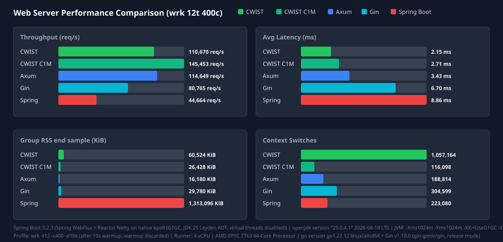

<p align="center">
  
</p>

<h1 align="center">CWIST</h1>
<p align="center"><strong>C Web development Is Still Trustworthy</strong></p>

<p align="center">
CWIST is a C17 web framework and application server with built-in HTTP/1.1, HTTP/2,
HTTP/3 (QUIC), WebSocket, and WebTransport support, hybrid post-quantum TLS
(X25519MLKEM768), an embedded SQLite ORM, and a synchronous io_uring/epoll/kqueue
reactor. It is written in plain C, links statically, and serves ~152k req/s at
1.59ms average latency in ~9.1MB of RSS (CI: `wrk -t12 -c400 -d10s` after warmup,
C1M reactor mode — see the benchmark block below; a tuned `wrk -t4 -c100` profile
reaches 0.41ms average at ~155k req/s).
</p>

[Heavy Benchmark on CWIST APP](https://github.com/gg582/fly.board/blob/main/README.md)

<!-- WEBSERVER_BENCHMARKS:START -->
Latest Web Server Benchmark (wrk -t12 -c400 -d10s (after 10s warmup, warmup discarded)):
- **CWIST (classic pool)**: 230149 req/s | Latency 1.08ms (P90 2.33ms, P99 5.81ms, P99.999 40.21ms) | RSS 16660KiB | Csw 0
- **CWIST (C1M reactor)**: 259149 req/s | Latency 1.69ms (P90 4.53ms, P99 14.96ms, P99.999 41.04ms) | RSS 9792KiB | Csw 0
- **CWIST (C1M reactor, arena_max=1)** — experimental, see issue #25: 251884 req/s | Latency 1.65ms (P90 4.42ms, P99 14.51ms, P99.999 28.79ms) | RSS 7228KiB | Csw 0
- **Axum**: 237285 req/s | Latency 1.68ms (P90 3.01ms, P99 4.82ms, P99.999 11.25ms) | RSS 17048KiB | Csw 0
- **Gin (Go)**: 190702 req/s | Latency 3.70ms (P90 9.92ms, P99 23.48ms, P99.999 58.27ms) | RSS 28440KiB | Csw 0
- **Spring Boot**: 127489 req/s | Latency 3.13ms (P90 4.38ms, P99 6.95ms, P99.999 40.37ms) | RSS 1316464KiB | Csw 0

**Spring runtime environment**

- **JDK:** `openjdk version "25.0.4.1" 2026-08-18 LTS`
- **Spring Boot:** 3.2.3
- **Stack:** Spring WebFlux + Reactor Netty on native epoll (G1GC, JDK 25 Leyden AOT, virtual threads disabled)
- **Virtual threads:** disabled

**JVM options**

```text
-Xms1024m
-Xmx1024m
-XX:+UseG1GC
-XX:GCTimeRatio=99
-XX:G1HeapRegionSize=1m
-XX:+AlwaysPreTouch
-XX:CompileThreshold=1500
-XX:CICompilerCount=4
-Djava.security.egd=file:/dev/urandom
-Djava.net.preferIPv4Stack=true
-Dio.netty.allocator.type=pooled
-Dio.netty.leakDetection.level=disabled
-Dio.netty.buffer.checkBounds=false
-Dio.netty.buffer.checkAccessible=false
-Dreactor.netty.ioWorkerCount=4
-Xlog:gc*:file=/tmp/spring_gc.log:time,uptime,level,tags
-XX:+AOTClassLinking
-XX:AOTCache=/tmp/spring_bench/app.aot (JEP 483 + JEP 514 single-step AOT)
```

**Warmup/profile**

wrk -t12 -c400 -d10s (after 10s warmup, warmup discarded)


<!-- WEBSERVER_BENCHMARKS:END -->

_Methodology, JVM options, and fairness settings: [docs/webserver-benchmark.md](docs/webserver-benchmark.md)_

<!-- TUNED_BENCHMARK:START -->
**Tuned low-latency run (wrk -t4 -c100 -d10s (after 10s warmup, warmup discarded)), CWIST vs Spring Boot on identical concurrency:**

- **CWIST**: 247,722 req/s at 0.29ms average latency (P50 0.17ms, P90 0.55ms, P99 2.02ms)
- **Spring Boot**: 135,609 req/s at 0.88ms average latency (P50 0.63ms, P90 2.05ms, P99 3.58ms), same trained AOT cache as the main run above

Leaving headroom between server workers and load-generator threads keeps the latency tail flat — oversubscribing the same cores shows a multi-ms average from scheduling jitter alone at similar throughput.
<!-- TUNED_BENCHMARK:END -->

---

## Install

CWIST vendors its dependencies (BoringSSL, lsquic, libttak, SQLite3), so a plain
build works on a fresh Linux, macOS, or BSD machine:

```sh
git clone https://github.com/c4punks/CWIST.git
cd cwist
make
sudo make install        # optional, installs to /usr/local (override with PREFIX=/opt/cwist)
```

### Homebrew

macOS and Linux (Linuxbrew) users can install the latest release from the
[CWIST tap](https://github.com/c4punks/homebrew-cwist):

```sh
brew tap c4punks/cwist
brew install cwist
```

Or install directly without tapping:

```sh
brew install c4punks/cwist/cwist
```

The formula builds from the release source tarball
(`dist/cwist-<version>.tar.gz`, vendored dependencies included) and installs
`libcwist.a`, public headers, the `cwist` CLI, and `cwist.pc` pkg-config
metadata under the Homebrew prefix.

## Hello world

```c
#include <cwist/app.h>

static void hello(cwist_http_request *req, cwist_http_response *res) {
    (void)req;
    cwist_sstring_assign(res->body, "Hello from CWIST!");
}

int main(void) {
    cwist_app *app = cwist_app_create();
    cwist_app_get(app, "/", hello);
    cwist_app_listen(app, 8080);
    cwist_app_destroy(app);
    return 0;
}
```

```sh
gcc -o server main.c -lcwist -lssl -lcrypto -lz -lzstd -lbrotlienc -lbrotlicommon -luriparser -lcjson -ldl -lpthread -lm
./server
```

A larger example with a database, post-quantum TLS, metrics, and RDBMS
auto-detection:

```c
#include <cwist/app.h>

static void hello(cwist_http_request *req, cwist_http_response *res) {
    (void)req;
    cwist_sstring_assign(res->body, "Hello from CWIST!");
}

int main(void) {
    cwist_app *app = cwist_app_create();

    /* SQLite + ORM-ready database */
    cwist_app_use_db(app, ":memory:");

    /* Post-Quantum TLS (hybrid X25519MLKEM768) */
    cwist_app_use_pqc_layer(app, true);

    /* Observability endpoints */
    cwist_app_enable_metrics(app);
    cwist_app_enable_healthz(app);

    /* Auto-detect PostgreSQL / MySQL / MariaDB on localhost */
    cwist_app_auto_rdbms(app, 5432);

    cwist_app_get(app, "/", hello);

    cwist_app_listen(app, 8080);
    cwist_app_destroy(app);
    return 0;
}
```

## What CWIST includes

Most C web frameworks stop at HTTP/1.1 and leave TLS, protocol upgrades, and
memory management to the user. CWIST ships the whole stack:

- **HTTP/3 & WebTransport** powered by lsquic (server-side sessions plus an experimental
  native C client on `dev`, backed by LSQUIC PR #629).
- **Post-Quantum TLS** with one call: `cwist_app_use_pqc_layer(app, true)`
  forces hybrid X25519MLKEM768 and disables legacy TLS < 1.3.
- **Server-side zero-copy I/O & C1M reactor** on io_uring / epoll / kqueue,
  with lock-free job queues and generational arena allocators from libttak.
- **Nuke DB**: a read-optimal, in-memory SQLite engine that syncs to disk on every COMMIT.
- **Auto-RDBMS detection**: probe any TCP port and mount PostgreSQL, MySQL,
  or MariaDB runtimes by wire-protocol fingerprinting.

| Layer | What you get |
|-------|-------------|
| **Protocols** | HTTP/1.1, HTTP/2 (h2/h2c), HTTP/3 (QUIC), WebSocket, WebTransport |
| **TLS / Security** | BoringSSL, PQC hybrid groups, ECH, JWT, DB Crypt, Monocypher |
| **Database** | SQLite3 + ORM, Nuke DB (in-memory + WAL sync), RDBMS auto-detection |
| **Routing** | Express-style `:param` routes, Mux router, chainable middleware |
| **Performance** | Zero-copy I/O, generational arenas, EBR GC, lock-free queues, Big Dumb Reply cache |
| **Async handlers** | Deferred responses (`cwist_async_defer` / `cwist_async_respond`): offload blocking work to a job thread and complete the request later without stalling the reactor |
| **Observability** | Structured access logs, metrics endpoint, healthz, rate limiting |
| **gRPC / Protobuf** | Unary and streaming routes, incremental framing, health/reflection services, Trailers-Only error responses, and `cwist proto` model/encoder/decoder generation (scalars, repeated, nested messages, enums). Channel client: dns/ipv4/ipv6 resolution, `pick_first`/`round_robin` load balancing, and gRFC A6 retries (backoff, pushback, throttling, transparent retries) |
| **Rendering** | HTML builder, CSS composer, template engine, JSON builder / heal |

## Why C, when Axum and Gin exist?

The benchmark results above demonstrate the advantages in latency, memory footprint, and determinism:

1. **Latency & Throughput.** Under 400 concurrency (`wrk -t12 -c400`, CI run above), CWIST Classic Pool delivers 1.52ms average latency at ~151k req/s, and C1M Reactor delivers 1.59ms at ~153k req/s (versus 2.55ms for Axum, 4.64ms for Gin, and 5.91ms for Spring Boot in the same run). In the tuned low-latency profile (`wrk -t4 -c100`), CWIST achieves 0.41ms average latency (P50 0.34ms, P90 0.69ms) at ~155k req/s.
2. **Memory Efficiency.** CWIST maintains a lean memory footprint (~9.1MB RSS in C1M mode, ~15.4MB in Classic Pool, same CI run), compared to ~29.8MB for Gin and ~1.29GB for Spring Boot. In high-density container environments, this significantly reduces memory consumption across thousands of instances.
3. **Tail Latency & Predictability.** Zero-copy framing, thread-pinned worker execution, and generational arena allocators minimize latency variance and GC pauses.
4. **Zero-Overhead FFI.** Production libraries in finance, game servers, machine learning, and systems software written in C/C++ link directly into CWIST with zero FFI conversion or runtime bridge penalty.
5. **Instant Cold Start.** With no runtime VM warmup or GC initialization required, CWIST starts in milliseconds and immediately serves requests at full capacity.

## Platform support

CWIST builds on Linux, macOS, and BSD. The HTTP/3 server and native client use
non-blocking UDP sockets on every platform; Linux uses `epoll`, BSD-family
systems use the portable polling path. ECN metadata is enabled only when the
host exposes the required socket options, so a missing optional API never
blocks an HTTP/3 build.

## Execution & I/O models: C1M Reactor and Classic Pool

CWIST provides two operational execution models tailored for different workload profiles:

1. **C1M Reactor Mode (`CWIST_C1M_MODE=1`, default)**: An event-driven asynchronous reactor designed for massive concurrent connections (`epoll` on Linux, `kqueue` on macOS/BSD). It uses non-blocking I/O multiplexing and cooperative scheduling with lock-free coordination to maintain low latency under high concurrency without per-connection thread overhead.
2. **Classic Pool Mode (`CWIST_C1M_MODE=0`)**: A worker thread pool model designed for low-jitter, predictable throughput on compute-bound workloads. In this mode, incoming requests are assigned to worker threads using thread-pinned queues and executed to completion inline on the worker stack.

### Readiness multiplexing vs full completion rings

On Linux, CWIST uses `io_uring` (raw syscalls, no liburing dependency) strictly as a readiness multiplexer, replacing `epoll_wait` in `src/sys/io/reactor.c`. The reactor arms one-shot `IORING_OP_POLL_ADD` requests. When a completion arrives, the woken worker performs inline I/O operations directly. If io_uring setup fails, the reactor falls back to epoll (kqueue on macOS/BSD) with identical behavior.

- **Direct readiness handling.** When a readiness notification arrives, the worker processes the event directly rather than routing multiple intermediate completion steps through userspace ring buffers on every tick.
- **Structural backpressure.** Work cannot unboundedly accumulate; per-worker concurrency limits allow the server to shed excess load under saturation rather than inflating tail latency.
- **Cache locality.** Handling request execution on contiguous worker stacks minimizes cache misses and fragmentation compared to multi-stage heap-allocated callback chains.
- **Deterministic tail.** Thread-pinned worker execution and generational arenas keep latency variance minimal across percentiles.

## Development hot reload

New projects include a self-describing `.cwpro` development command. Run the
watcher from the project directory to calculate the affected translation units,
incrementally invoke the build, and restart the app only after a successful
build. It uses Linux `inotify` or BSD/macOS `kqueue` for low-latency wakeups,
with an mtime snapshot and polling fallback to prevent missed rebuilds. The
previous process remains available if a build fails.

```sh
cwist watcher
```

Use `cwist watcher --no-run` for CI or rebuild-only use, or `--poll` to force
portable polling. `dev.debounce_ms` and `dev.stop_timeout_ms` in the manifest
control atomic-save coalescing and graceful process shutdown.

## Managing a project with the cwist CLI

`make install` also installs the `cwist` command line tool into `$(PREFIX)/bin`.

```sh
# Scaffold a project: src/main.c, Makefile, and a demo.cwpro manifest
cwist new project demo --directory ~/src
cd ~/src/demo

# Build and run like the generated Makefile does
make            # cc src/main.c -lcwist -lpthread  (needs CWIST installed)
./bin/demo

# Develop with hot reload (incremental rebuild + zero-downtime restart)
cwist watcher

# Generate OpenAPI 3.1 from Doxygen @openapi.* route annotations
cwist openapi

# Generate C models and gRPC method paths from proto3 definitions
cwist proto api.proto

# Inspect the project manifest and detected routes
cwist describe
```

The `.cwpro` manifest (`cwist-project/v1`) is the single source of truth for
the watcher and generators: entry point, include paths, dev debounce/stop
timeouts, and route discovery scope all live there, so builds stay reproducible
across machines without extra configuration.

## Linking

CWIST's `libcwist.a` is a **thin static archive**: it contains only CWIST
objects. `make install PREFIX=/opt/cwist` installs its built external
submodules separately in `/opt/cwist/lib/cwist`, and installs their public
headers in `/opt/cwist/include/cwist/vendor`.

Compile against both header directories and link against both library
directories. This keeps third-party archives independently replaceable and
avoids duplicate symbols from a merged (fat) archive.

```sh
gcc -I/opt/cwist/include -I/opt/cwist/include/cwist/vendor main.c \
    -L/opt/cwist/lib -L/opt/cwist/lib/cwist -lcwist \
    -llsquic -lssl -lcrypto -lnats_static -lttak -lcjson -luriparser \
    -lz -lzstd -ldl -lpthread -lm -lstdc++
```

`DESTDIR` is supported for staged packages, for example
`make install PREFIX=/usr DESTDIR=/tmp/cwist-package`.

The order above matters for static linking: CWIST first, then its dependencies.

### Required flags (always needed)

| Flag | Provides |
|------|----------|
| `-lcwist` | The framework itself |
| `-llsquic -lssl -lcrypto` | HTTP/3/QUIC and TLS (bundled BoringSSL) |
| `-lz` | zlib: gzip/deflate compression and internal use |
| `-lzstd` | Zstandard: payload compression (preferred algorithm) |
| `-lbrotlienc -lbrotlicommon` | Brotli: payload compression |
| `-lnats_static -lttak -luriparser -lcjson` | Bundled NATS, libttak, URI parsing, and JSON |
| `-ldl` | Dynamic loading (RDBMS auto-mount) |
| `-lpthread` | POSIX threads |
| `-lm` | Math (used by libttak) |

### Optional flags (feature-dependent)

| Flag | When required |
|------|---------------|
| `-lnghttp2` | HTTP/2 support |
| `-lngtcp2 -lngtcp2_crypto_quictls` | HTTP/3 / QUIC |
| `-lnghttp3` | HTTP/3 QPACK |
| `-lcurl` | RDBMS auto-mount wire probing |

### pkg-config (installed since v3.2)

`make install` ships `cwist.pc`, so the flags above collapse into one line:

```sh
gcc -o server main.c $(pkg-config --cflags --libs cwist)
```

For static linking, use `pkg-config --cflags --libs --static cwist`, which also
pulls in the optional libs (`-lcurl`, `-lnghttp2`).

### pkg-config snippet for Makefile

```makefile
CWIST_LIBS := -lcwist \
              -lssl -lcrypto \
              -lz -lzstd -lbrotlienc -lbrotlicommon \
              -luriparser -lcjson \
              -ldl -lpthread -lm

# Append optional libs if present on the build host
CWIST_LIBS += $(shell pkg-config --libs libnghttp2  2>/dev/null)
CWIST_LIBS += $(shell pkg-config --libs libngtcp2   2>/dev/null)
CWIST_LIBS += $(shell pkg-config --libs libnghttp3  2>/dev/null)
CWIST_LIBS += $(shell pkg-config --libs libcurl     2>/dev/null || echo -lcurl)

your_target: your_source.c
	$(CC) -o $@ $< $(CWIST_LIBS)
```

> **Note** — `brotlienc` and `brotlicommon` ship as **`libbrotli-dev`** on
> Debian/Ubuntu and **`brotli-devel`** on Fedora/RHEL. `zstd` ships as
> **`libzstd-dev`** / **`libzstd-devel`**.

## Configuration

CWIST bundles a lightweight configuration loader that reads `.env` files and
environment variables with optional prefixes.

### Loading `.env` files

```c
cwist_config *cfg = cwist_config_create();
cwist_config_load_file(cfg, ".env");

const char *db_url = cwist_config_get(cfg, "DATABASE_URL");
int workers       = cwist_config_get_int(cfg, "WORKERS", 4);
bool debug        = cwist_config_get_bool(cfg, "DEBUG", false);

cwist_config_destroy(cfg);
```

### Loading environment variables by prefix

```c
cwist_config_load_env(cfg, "CWIST_");
/* Now CWIST_PORT=8080 is accessible as cwist_config_get(cfg, "CWIST_PORT") */
```

### `.env` file format

```bash
# Lines starting with # are comments
PORT=8080
DATABASE_URL="sqlite3:data.db"
DEBUG=true
WORKERS=4
```

- Keys and values are separated by `=`.
- Values may be quoted with double quotes (`"..."`).
- Leading/trailing whitespace around keys and values is trimmed automatically.

### Framework-built-in environment variables

These variables are read directly by the framework runtime (no prefix required):

| Variable | Type | Default | Description |
|----------|------|---------|-------------|
| `CWIST_WORKERS` | integer | `1` | Number of worker processes to fork before entering the event loop. |
| `CWIST_C1M_MODE` | boolean | `true` | Enables the high-concurrency C1M async server loop. Set to `0` or `false` to fall back to a blocking accept loop. |
| `CWIST_HTTP_BATCH` | integer | `16` | Maximum pipelined HTTP/1.1 requests dispatched per event-loop turn (clamped to `[1, 1024]`). Excess requests are deferred via reactor continuations. |
| `CWIST_HTTP_YIELD_BATCH` | integer | `16` (derived from batch) | Request dispatch yield granularity within a batch before re-posting connection to reactor queue. |
| `CWIST_ASYNC_DEBUG` | boolean | unset | When set, the C1M async path and the reactor log rare failure events (rearm/submit/SQ failures) to stderr. No output in normal operation. |

**C1M mode is now measured, not theoretical.** With the event-driven one-shot
connection path (connections live in the io_uring/epoll reactor instead of
parking a worker thread each), a single cwist server on loopback served:

| Scale | Result | Wall time | Server peak RSS |
|-------|--------|-----------|-----------------|
| C10K | 10,000 / 10,000 established + responded (100%) | ~0.7 s | ~111 MB |
| C100K | 100,000 / 100,000 responded (100%) | ~8.7 s | ~124 MB |
| C1M (8×125K) | 1,000,000 / 1,000,000 responded (100%) | ~14–16 s per client process | ~244 MB |

Peak RSS is the summed `VmHWM` high-water mark across the 12 forked
worker processes (the server defaults to one worker per core); the arena
bump allocator with a shared per-request arena keeps a million held
connections inside a quarter gigabyte of resident memory.

The classic thread-per-connection path (`CWIST_C1M_MODE=0`) is no longer
capped at `cores*8` held connections either: every accepted connection gets
its own on-demand detached thread with a 256 KiB stack, so held connections
scale with the task budget instead of parking a fixed worker pool. Measured
on the same machine, same client:

| Scale | Result | Wall time | Server peak RSS |
|-------|--------|-----------|-----------------|
| C10K | 10,000 / 10,000 responded (100%) | ~0.8 s | ~950 MB |
| C100K | 100,000 / 100,000 responded (100%) | ~9.6 s | ~9.2 GB |

C100K classic needs task-count headroom (one thread per held connection:
`pids.max` / `TasksMax` above 100K — desktop app scopes often cap this near
76K — and `kernel.threads-max` is fine by default) and roughly 26 GB of
virtual commit budget for 100K x 256 KiB stacks (about 9.2 GB of that
actually resident; raise `vm.overcommit_ratio` when RAMxratio + swap is
tight). C1M is out of reach
for this model — a million threads exceeds `threads-max` — which is exactly
what the reactor path is for.

**Which mode should you pick?** Most HTTP workloads are request bursts,
not held connections: APIs behind a reverse proxy, web pages, webhooks.
There the classic path is the right default — a dedicated thread per active
connection gives the kernel scheduler direct per-connection fairness with
no reactor round trip, which is where cwist's sub-millisecond latency comes
from in the tuned profile (0.41ms average at ~155k req/s with `wrk -t4 -c100`;
the shared-core CI run at `wrk -t12 -c400` lands at 1.52ms / ~151k req/s — see
the benchmark block above). Flip C1M mode on when you must *hold* very large numbers of
simultaneously open, mostly idle connections — SSE fan-out, websocket-scale
chat, long-polling — or when you genuinely target C1M. Giving up C1M for
the classic path costs you nothing until your workload is dominated by
hundreds of thousands of idle open sockets.

Benchmark environment:

- CPU: AMD Ryzen 5 5600X (6 cores / 12 threads)
- RAM: 62 GB
- Kernel: Linux 6.12.101 (Debian 13), GCC 14.2.0
- Network: loopback (127.0.0.0/8 source-IP spreading on the client side)

Measured with `tests/bench_cxm.c` (multi-process epoll load client,
deterministic source-port allocation round-robined over multiple 127.0.0.x
addresses, `SO_REUSEADDR` on every client socket so reruns within the
TIME_WAIT window do not collide with themselves). Kernel prerequisites
for C100K and above:

- `ulimit -n 1050000` (and `fs.file-max` ≥ 8M for C1M: each connection costs
  one file descriptor on client and server side alike)
- `net.netfilter.nf_conntrack_max=4194304` — loopback traffic is conntracked
  too, and the default 262144 caps you near ~263K connections
- `net.ipv4.ip_local_port_range="1024 65535"` on the client side

Known limits of the current async path: cleartext HTTP/1.x only (HTTPS still
uses the thread-pool model for the request phase), a handler that writes
faster than the socket drains waits inside the reactor thread (bounded by
`CWIST_HTTP_TIMEOUT_MS`), and idle keep-alive connections are not yet reaped
by a timer.

**HTTPS churn experiment (handshake shepherd).** HTTPS accepts go through
`cwist_https_dispatch()`: a single non-blocking `SSL_accept` attempt, with
incomplete handshakes parked in a private epoll set owned by one shepherd
thread (Linux-only; other platforms fall back to the blocking pool path).
Parked handshakes are reaped after `CWIST_HTTPS_HANDSHAKE_TIMEOUT_MS`
(45 s, compile-time). This replaced a synchronous in-worker handshake that stalled the accept loop
under churn (accept-queue overflow, silently dropped handshakes, "phantom"
ESTABLISHED clients). Measured on the benchmark machine above (fly.board,
TLS 1.3, loopback, same kernel/sysctl tuning):

- Load: 20 `h2load` processes x `-c 5000 -n 50000 -r 1000 -T 30` against
  `https://127.0.0.$i:8888/` (1,000,000 requests total).
- Before the fix: deadlocked within minutes (0 completed requests, hundreds
  of phantom connections).
- After the fix: completes in ~7 min, 756,610 / 1,000,000 requests (75.7%),
  zero phantom connections. The remaining ~24% are slow handshakes reclaimed
  by h2load's `-T 30` timeout while queued behind the single shepherd
  thread. The shepherd has since been sharded across
  `CWIST_HTTPS_HS_MAX_SHARDS` threads (hashed by fd, default derived from the
  request worker count); tuning `CWIST_HTTPS_HS_SHARDS` against connect-burst
  workloads is the next performance candidate.
- Regression check: `h2load -c 1000 -n 10000` passes at 100%
  (~1,780 req/s), and `make test_https` passes.

Some example applications (e.g. `example/othello-web`) also read the standard
`PORT` variable when no explicit port is given.

## Nuke DB

Read-from-RAM, Write-to-Disk. Nuke DB loads an on-disk SQLite file into memory
via `sqlite3_deserialize`, runs `PRAGMA integrity_check`, and then serves every
query from RAM. Every COMMIT triggers a background WAL sync. If bootstrap
fails, it falls back to read-only disk protection mode.

```c
cwist_nuke_init("data.db", 5000);   /* 5-second auto-sync interval */
cwist_db *db = cwist_nuke_get_db();
```

## libttak performance core

CWIST links the in-tree **libttak** allocator/reactor toolkit:

- **Generational Arena Allocator**: static assets and BDR blobs are released in
  one shot, eliminating RSS fragmentation.
- **Epoch-Based Reclamation (EBR)**: `ttak_epoch_enter/exit` pin critical
  sections; stale buffers are reclaimed automatically.
- **Detachable Memory**: signal-safe, cache-aligned arenas for TLS write
  buffers and WebSocket frames.
- **Lock-Free Job Queue**: producers push with a single atomic swap; consumers
  reuse detached nodes to prevent fragmentation.

## PQC TLS layer

Enable post-quantum cryptography with one line:

```c
cwist_app_use_pqc_layer(app, true);
```

This forces `X25519MLKEM768:X25519:P-256`, sets TLS 1.3 as the minimum version,
and strips all legacy TLSv1.0-1.2 ciphers. Application code never touches
OpenSSL directly.

## WebTransport

CWIST exposes server-side WebTransport over HTTP/3:

```c
cwist_app_use_webtransport(app, my_wt_handler);
```

The framework handles the CONNECT negotiation, keeps the stream open after 2xx,
and provides `cwist_webtransport_read/write/flush/close/open_bidi/open_uni`
APIs.

## RDBMS auto-mount

Point CWIST at a local TCP port and it detects the provider by wire protocol:

```c
if (cwist_app_auto_rdbms(app, 5432)) {
    /* PostgreSQL, MySQL, or MariaDB runtime mounted */
}
```

No port-number guessing: CWIST sends a PostgreSQL StartupMessage or reads a
MySQL Handshake initiation packet to classify the server.

## Dependencies

- BoringSSL (in-tree)
- lsquic (in-tree, compiled with `-DLSQUIC_WEBTRANSPORT=ON`)
- libttak (in-tree)
- SQLite3 (in-tree)
- cJSON
- uriparser
- Monocypher
- zlib
- Brotli (`libbrotlienc`, `libbrotlicommon`)
- Zstandard (`libzstd`)

See [NOTICE.md](NOTICE.md) for the license summary of every vendored component.

## Stability & conformance

- **Versioning**: until CWIST 4.0, minor releases may adjust public APIs; pin
  an exact tag in production. Draft-level features cycle through `dev` and
  may appear/disappear between tags without a stability guarantee.
- **Conformance gates**: every push runs the test suite under ASan/UBSan with
  `-Werror`, plus an h2spec HTTP/2 conformance diff against a pinned baseline
  (`scripts/ci/h2spec-baseline.txt`); regressions fail the build. Known
  conformance gaps are tracked in that baseline file.

## Documentation

The full documentation map lives in [docs/README.md](docs/README.md). The short
version, in suggested reading order:

- **[Tutorials](tutorials/README.md)** — 30 hands-on modules (`tutorials/01..30`),
  each with a runnable `main.c`, a `CMakeLists.txt`, and a guided README.
- **[Guides](docs/tutorials/)** — task-oriented walkthroughs: [CRUD blog](docs/tutorials/blog-crud.md),
  [NATS integration](docs/tutorials/nats-integration.md), [WebTransport server](docs/tutorials/webtransport-server.md).
- **[API reference](docs/API.md)** — per-module docs under `docs/api/`, plus the
  [flat quick reference](docs/api-quickref.md) and generated
  [Doxygen HTML](https://c4punks.github.io/CWIST/).
- **[ROADMAP.md](ROADMAP.md)** — feature status and milestone planning.

## Examples

Runnable demos under [example/](example/): a [minimal server](example/simple-server),
[step-by-step HTTP](example/http), [SQLite](example/db) and
[encrypted-column DB](example/db-crypt), [JWT auth](example/jwt), a
[WebSocket Othello game](example/othello-web), the [rps-showcase](example/rps-showcase)
throughput demo, rendering helpers ([json-builder](example/json-builder),
[html](example/html), [template](example/template)), and the experimental
[WebTransport](example/webtransport) app. See the
[examples table](docs/README.md#4-runnable-examples) for the full list.

A production deployment built on CWIST: [fly.board](https://github.com/gg582/fly.board).

## Third-Party Licenses

CWIST vendors its dependencies under `lib/`; each retains its own license
(full summary in [NOTICE.md](NOTICE.md), authoritative text in each
submodule's license file):

| Component | License |
|-----------|---------|
| BoringSSL | Apache-2.0 |
| lsquic | MIT (some Chromium-derived parts BSD-3-Clause) |
| nghttp3, ngtcp2, cJSON, multipart-parser-c | MIT |
| libttak | BSD-3-Clause |
| SQLite | Public Domain |
| cnats | Apache-2.0 |
| uriparser | BSD-3-Clause (library only; its test suite is LGPL-2.1-or-later and is not linked) |
| Monocypher | BSD-2-Clause OR CC0-1.0 (dual) |

Static linking propagates each component's license obligations to linked
binaries; review [NOTICE.md](NOTICE.md) when distributing.
